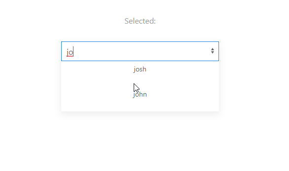

# React-UIKit-Typeahead

A Typeahead component built for React with [UIKit3](https://https://getuikit.com/)
<p align="center">
  
</p>

## Installing

Install the package with npm or Yarn

```React
npm i react-uikit-typeahead --save
or
yarn add react-uikit-typeahead

```

Next, Import the Module and supply props

```React
import MultiSelect from "react-uikit-typeahead";
...

<div class="uk-form-controls">
    <TypeAhead
        suggestions={this.state.typeAheadSuggestions}
        handleTypeAheadChange={this.handleTypeAheadChange} />
</div>
```

## Built With

* [UIKit3](http://www.dropwizard.io/1.0.2/docs/) - CSS Library
* [React](https://maven.apache.org/) - Front-end Library

## Contributing

* Coming Soon

## Authors

* **Josh Lavely** - *Initial work*  *

See also the list of [contributors](https://github.com/Azayzel/react-uikit-multiselect) who participated in this project.

## License

This project is licensed under the MIT License - see the [LICENSE.md](LICENSE.md) file for details
